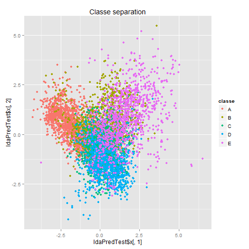

Synopsis
========

This is a project is part of the Coursera Data Science specialization from the Johns Hopkins University.
In this specific work the goal is to predict the manner of performing unilateral dumbbell biceps curls based on data from accelerometers on the belt, forearm, arm, and dumbell of 6 participants.

Data Processing
===============
This section consists of installing the necessary packages and loading the data.


```r
library(caret)
training <- read.csv("pml-training.csv", header=TRUE, as.is = TRUE, stringsAsFactors = FALSE, sep=',', na.strings=c('NA','','#DIV/0!'))
validation <- read.csv("pml-testing.csv", header=TRUE, as.is = TRUE, stringsAsFactors = FALSE, sep=',', na.strings=c('NA','','#DIV/0!')) #Will be used as validation set
set.seed(100)
inTrain <- createDataPartition(y=training$classe, p=0.7, list=F)
forTrain <- training[inTrain, ]
forTest <- training[-inTrain, ]
dim(forTrain)
```

```
## [1] 13737   160
```

```r
dim(forTest)
```

```
## [1] 5885  160
```

Data Process
------------
On this step the aim is to reduce the dimension by not including non relevant predictors based on their "Near Zero Variance" as well as removing columns with NA's.


```r
forTrain <- forTrain[, colSums(is.na(forTrain)) == 0] #getting rid of NA
trainNZV <- nearZeroVar(forTrain) # Removing non-significant variables
if(length(trainNZV) > 0) forTrain <- forTrain[, -trainNZV]
forTrain<-forTrain[,-(1:5)]
```

Model Options
=============

After data clean-up, the approach will be based on 2 models: Linear Discriminant Analysis (LDA) and Random Forest for categorical data.

First approach: LDA


```r
library(MASS)
ldaModel<-lda(classe~.,data=forTrain)
ldaPred <-predict(ldaModel,forTrain)
prop<-ldaModel$svd^2/sum(ldaModel$svd^2)
prop
```

```
## [1] 0.4800285 0.2376433 0.1739910 0.1083371
```

```r
ldaPredTest<-predict(ldaModel,newdata=forTest[colnames(forTrain)])
confusionMatrix(ldaPredTest$class,forTest$classe)
```

```
## Confusion Matrix and Statistics
## 
##           Reference
## Prediction    A    B    C    D    E
##          A 1381  173  107   56   44
##          B   47  722  100   38  172
##          C  125  161  688  121  101
##          D  116   43  104  705  108
##          E    5   40   27   44  657
## 
## Overall Statistics
##                                           
##                Accuracy : 0.7057          
##                  95% CI : (0.6939, 0.7173)
##     No Information Rate : 0.2845          
##     P-Value [Acc > NIR] : < 2.2e-16       
##                                           
##                   Kappa : 0.6274          
##  Mcnemar's Test P-Value : < 2.2e-16       
## 
## Statistics by Class:
## 
##                      Class: A Class: B Class: C Class: D Class: E
## Sensitivity            0.8250   0.6339   0.6706   0.7313   0.6072
## Specificity            0.9098   0.9248   0.8955   0.9246   0.9758
## Pos Pred Value         0.7842   0.6691   0.5753   0.6552   0.8499
## Neg Pred Value         0.9290   0.9132   0.9279   0.9461   0.9169
## Prevalence             0.2845   0.1935   0.1743   0.1638   0.1839
## Detection Rate         0.2347   0.1227   0.1169   0.1198   0.1116
## Detection Prevalence   0.2992   0.1833   0.2032   0.1828   0.1314
## Balanced Accuracy      0.8674   0.7793   0.7830   0.8280   0.7915
```

```r
qplot(ldaPredTest$x[,1],ldaPredTest$x[,2],data=forTest,color=classe,main="Classe separation")
```

 

As observed, usian LDA technique we cannot have a clear separation of the groups. Now will try the next approach.

2nd Approach: Random Forest


```r
rf.fit<-train(classe~.,data=forTrain, method="rf",trControl=trainControl(method="cv",number=5))
rf.pred<-predict(rf.fit,newdata=forTest[colnames(forTrain)])
confusionMatrix(forTest$classe,rf.pred)
```

```
## Confusion Matrix and Statistics
## 
##           Reference
## Prediction    A    B    C    D    E
##          A 1674    0    0    0    0
##          B    5 1134    0    0    0
##          C    0    1 1025    0    0
##          D    0    0    7  957    0
##          E    0    0    0    0 1082
## 
## Overall Statistics
##                                           
##                Accuracy : 0.9978          
##                  95% CI : (0.9962, 0.9988)
##     No Information Rate : 0.2853          
##     P-Value [Acc > NIR] : < 2.2e-16       
##                                           
##                   Kappa : 0.9972          
##  Mcnemar's Test P-Value : NA              
## 
## Statistics by Class:
## 
##                      Class: A Class: B Class: C Class: D Class: E
## Sensitivity            0.9970   0.9991   0.9932   1.0000   1.0000
## Specificity            1.0000   0.9989   0.9998   0.9986   1.0000
## Pos Pred Value         1.0000   0.9956   0.9990   0.9927   1.0000
## Neg Pred Value         0.9988   0.9998   0.9986   1.0000   1.0000
## Prevalence             0.2853   0.1929   0.1754   0.1626   0.1839
## Detection Rate         0.2845   0.1927   0.1742   0.1626   0.1839
## Detection Prevalence   0.2845   0.1935   0.1743   0.1638   0.1839
## Balanced Accuracy      0.9985   0.9990   0.9965   0.9993   1.0000
```

Summary
=======

No doubt that the Random Forest approach gave a much better results havin an accuracy between 0.9962 to 0.9988 on a 95% confidence level and this is what we will use.
It is worthy saying that there are any other model and techniques that could be used as awell.

Project Submission
==================

As part of the final grade, there is a requirement to submit the chosen model and apply it in the validation set.

Preparing the "Validation" dataset


```r
validation <-validation[colnames(forTrain)[1:53]]
randomVal <- predict(rf.fit,newdata=validation)
```

Now, this procedure to make it automated the file generation required to be uploaded.


```r
pml_write_files = function(x){
  n = length(x)
  path <- getwd()
  for(i in 1:n){
    filename = paste0("problem_id_",i,".txt")
    write.table(x[i],file=file.path(path, filename),quote=FALSE,row.names=FALSE,col.names=FALSE)
  }
}
pml_write_files(randomVal)
```
